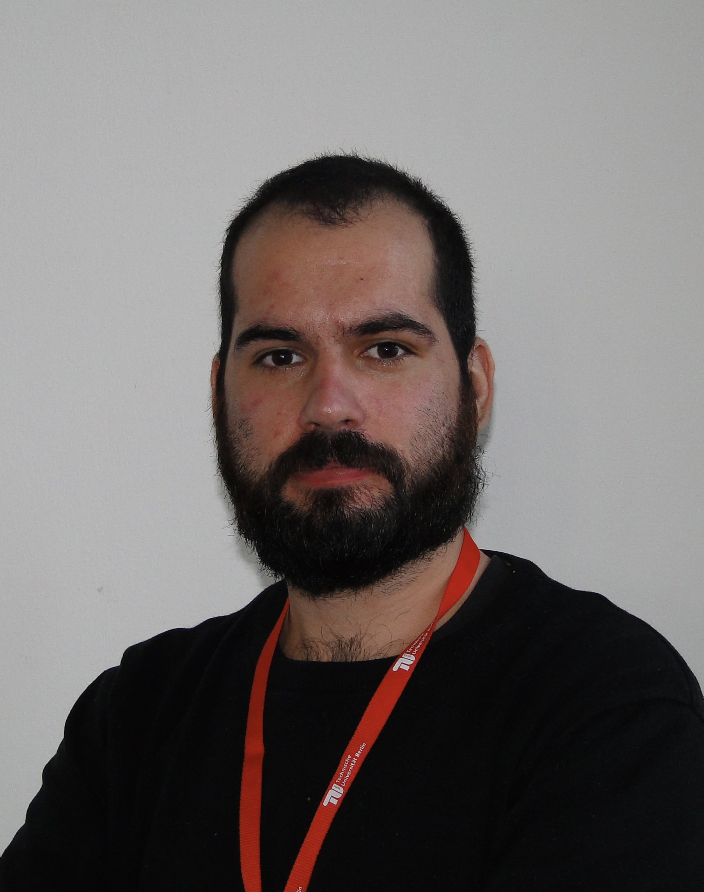

<!--  <br /> -->
<head>
  <meta charset="utf-8">
  <meta name="viewport" content="width=device-width">
  <title>MathJax example</title>
  <script src="https://polyfill.io/v3/polyfill.min.js?features=es6"></script>
  <script id="MathJax-script" async
          src="https://cdn.jsdelivr.net/npm/mathjax@3.0.1/es5/tex-mml-chtml.js">
  </script>
</head>

<!-- $$A^{-1}= $$ ```np.linalg.solve(A,I)```<br /> -->

# About me
I am a [PhD student](https://www.tu.berlin/en/fgmso/alessandro-borghi) in the group [FG Modellierung, Simulation und Optimierung realer Prozesse](https://www.tu.berlin/en/fgmso) of [Prof. Dr. Tobias Breiten](https://www.tu.berlin/en/fgmso/tobias-breiten). My position is given by the DFG as part of the [daedalus](https://daedalus.berlin/) group. 
The topic of my project deals with the development of cool algorithms for making hard models computationally accessible.
My research has connections with _data-driven reduced order modeling_, _numerical linear algebra_, _control theory_, and _approximation theory_. 

<!--My research focuses on the design and implementation of algorithms for solving nonlinar eigenvalue problems. In particular I am interested on the identification of _exceptional points_. -->


# Education
- **PhD student** at TU Berlin / Institut für Mathematik, [member of daedalus](https://daedalus.berlin/people/alessandro-borghi) <br/>(Berlin, Germany) <br/>[Oct.2021-Present]
- **master in systems & control** at Delft university of technology / 3mE department / DCSC <br/>(Delft, Netherlands) <br/>[Sep.2019-Oct.2021]
- **bachelor in automation engineering** for double bachelor program with Tongji university <br/>(Shanghai, China) <br/>[Sep. 2016-Jul.2019]
- **bachelor automation engineering** at university of Bologna <br/>(Bologna, Italy) <br/>[Sep. 2015-Dec.2018]

For a more detailed description of my experience click [here!](experience.md)

# Research interests
- numerical linear algebra
- data-driven model order reduction
- approximation theory
- Koopman operator theory
- random matrix theory


# Talks and Conferences
- [pyMOR summer school](https://2022.school.pymor.org), magdeburg, germany -- presentation<br/>
- [MORE 2022](https://more.sciencesconf.org/), berlin, germany -- part of the co-organizing team
- [YMMOR2023 workshop](https://www.uni-ulm.de/mawi/institut-fuer-numerische-mathematik/forschung/ymmor-workshop-2023/), ulm, germany -- presentation <br/>
- [Nonlinear model order reduction for control](https://personal.math.vt.edu/jborggaa/nlromc/index.html), blacksburg (va), united states -- presentation <br/>
- [ILAS 2023](http://ilas2023.es/), madrid, spain -- invited talk <br/>

# Memberships
- mentee at [LeadTheFuture](https://www.leadthefuture.tech/)


