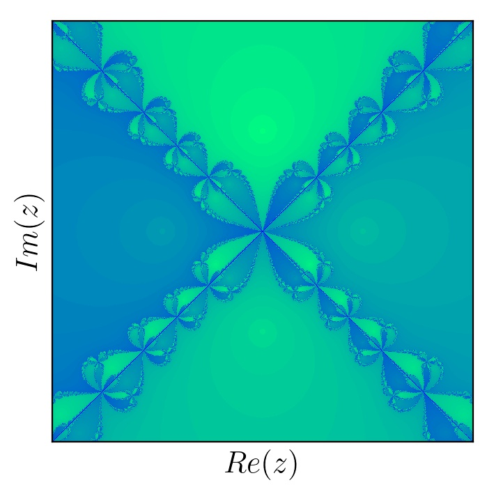
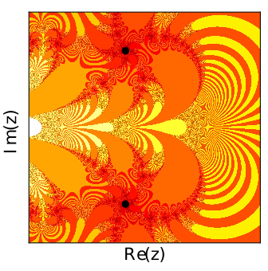

## Fancy Plots

These fractals describe the sets of initial conditions of the Newton's method that convergence to different points. Newton's method is an iterative method described by the following rule
$$z_{n+1}=z_{n} - \frac{f(z_n)}{f'(z_n)}.$$

